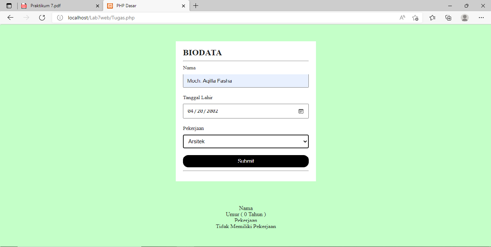

# Lab7Web
# Belajar PHP Dasar

## Contoh PHP Dasar
1. Membuat kode seperti berikut

* Maka akan muncul seperti gambar berikut

2. Menampilkan data diri menggunakan variabel

3. Membuat form input nama

# Tugas

Pertanyaan dan Tugas. Buatlah program PHP sederhana dengan menggunakan form input yang menampilkan nama, tanggal lahir, dan pekerjaan. Kemudian tampilkan outputnya dengan menghitung umur berdasarkan inputan tanggal lahir. Dan pilihlah pekerjaan dengan gaji yang berbeda beda sesuai pilihan pekerjaan.

1. Membuat kode program PHP sederhana

2. Kode CSS

3. Hasil inputan data

4. Hasil output data

